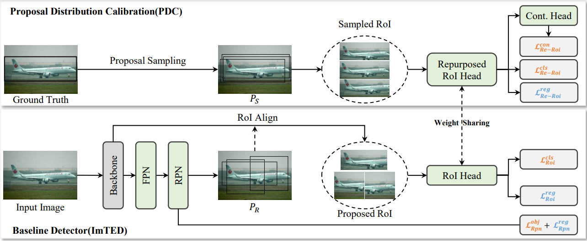

## Proposal Distribution Calibration for Few-Shot Object Detection

<!-- 

 -->

<!-- 

 -->

Code of [Proposal Distribution Calibration for Few-Shot Object Detection](https://arxiv.org/abs/2212.07618).

The code is based on [mmdetection](https://github.com/open-mmlab/mmdetection) and [imTED](https://github.com/LiewFeng/imTED). Thanks a lot to these outstanding work. Please refer to [get_started.md](docs/en/get_started.md) and [MMDET_README.md](MMDET_README.md) to set up the environment and prepare the data.

## Data Preparation

For few-shot experiments, please refer to [FsDet](https://github.com/ucbdrive/few-shot-object-detection/blob/master/datasets/README.md#:~:text=2%2C%20and%203.-,COCO%3A,-cocosplit/%0A%20%20datasplit/%0A%20%20%20%20trainvalno5k) for data preparation. Remember to modify the path of json in the configuration files, e.g. configs/imted/few_shot_pdc/imted_faster_rcnn_vit_base_2x_base_training_coco.py.

In run_train_pdc_few_shot.sh, you can get the relevant running commands about base training stage and finetune stage for coco dataset.

More detail about experiment for voc dataset and coco dataset will release soon.

## Results on VOC Benchmark

  |Method| | |Split-1| | | | |Split-2| | | | |Split-3| | |
  |:----|:----|:----|:----|:----|:----|:----|:----|:----|:----|:----|:----|:----|:----|:----|:----|
  |Shot|1|2|3|5|10|1|2|3|5|10|1|2|3|5|10|
  |[YOLO-ft](https://openaccess.thecvf.com/content_ICCV_2019/papers/Kang_Few-Shot_Object_Detection_via_Feature_Reweighting_ICCV_2019_paper.pdf)|6.6|10.7|12.5|24.8|38.6|12.5|4.2|11.6|16.1|33.9|13.0|15.9|15.0|32.2|38.4|
  |[FRCN-ft](https://arxiv.org/abs/1506.01497)|13.8|19.6|32.8|41.5|45.6|7.9|15.3|26.2|31.6|39.1|9.8|11.3|19.1|35.0|45.1|
  |[FSRW](https://openaccess.thecvf.com/content_ICCV_2019/papers/Kang_Few-Shot_Object_Detection_via_Feature_Reweighting_ICCV_2019_paper.pdf)|14.8|15.5|26.7|33.9|47.2|15.7|15.2|22.7|30.1|40.5|21.3|25.6|28.4|42.8|45.9|
  |[TFA](http://proceedings.mlr.press/v119/wang20j/wang20j.pdf)|39.8|36.1|44.7|55.7|56.0|23.5|26.9|34.1|35.1|39.1|30.8|34.8|42.8|49.5|49.8|
  |[MPSR](https://arxiv.org/abs/2007.09384)|41.7|-|51.4|55.2|61.8|24.4|-|39.2|39.9|47.8|35.6|-|42.3|48.0|49.7|
  |[CME](https://openaccess.thecvf.com/content/CVPR2021/papers/Li_Beyond_Max-Margin_Class_Margin_Equilibrium_for_Few-Shot_Object_Detection_CVPR_2021_paper.pdf)|41.5|47.5|50.4|58.2|60.9|27.2|30.2|41.4|42.5|46.8|34.3|39.6|45.1|48.3|51.5|
  |[FSCE](https://openaccess.thecvf.com/content/CVPR2021/papers/Sun_FSCE_Few-Shot_Object_Detection_via_Contrastive_Proposal_Encoding_CVPR_2021_paper.pdf)|44.2|43.8|51.4|61.9|63.4|27.3|29.5|43.5|44.2|50.2|37.2|41.9|47.5|54.6|58.5|
  |[imTED-S](https://arxiv.org/pdf/2205.09613.pdf)(Our Implement)|43.4|51.0|58.1|67.6|66.6|23.2|26.9|39.4|44.2|52.7|49.9|48.8|56.4|61.4|61.1|
  |[imTED-S+PDC](https://arxiv.org/pdf/2212.07618.pdf)|50.1|52.3|60.2|70.7|68.4|23.3|28.5|43.2|48.4|54.6|53.0|50.8|57.7|63.8|62.9|
  |[imTED-B](https://arxiv.org/pdf/2205.09613.pdf)(Our Implement)|56.8|64.8|69.4|**80.1**|76.8|37.4|38.1|59.1|**57.6**|60.9|**60.9**|59.3|70.0|**73.9**|75.7|
  |[imTED-B+PDC](https://arxiv.org/pdf/2212.07618.pdf)|**61.8**|**69.1**|**70.2**|78.7|**79.6**|**42.9**|**41.2**|**60.0**|56.3|**65.9**|60.3|**63.1**|**70.6**|73.3|**76.7**|

## Results on COCO Benchmark

  |Method| mAPnovel | |
  |:---:|:---:|:---:|
  | Shot | 10 |  30 |
  |[FRCN-ft](https://arxiv.org/abs/1506.01497)|6.5|11.1|
  |[FSRW](https://openaccess.thecvf.com/content_ICCV_2019/papers/Kang_Few-Shot_Object_Detection_via_Feature_Reweighting_ICCV_2019_paper.pdf)|5.6|9.1|
  |[MetaDet](https://openaccess.thecvf.com/content_ICCV_2019/papers/Wang_Meta-Learning_to_Detect_Rare_Objects_ICCV_2019_paper.pdf)|7.1|11.3|
  |[MetaR-CNN](https://openaccess.thecvf.com/content_ICCV_2019/papers/Yan_Meta_R-CNN_Towards_General_Solver_for_Instance-Level_Low-Shot_Learning_ICCV_2019_paper.pdf)|8.7|12.4|
  |[TFA](http://proceedings.mlr.press/v119/wang20j/wang20j.pdf)|10.0|13.7|
  |[MPSR](https://arxiv.org/abs/2007.09384)|9.8|14.1|
  |[imTED-S](https://arxiv.org/pdf/2205.09613.pdf)|15.0|21.0|
  |[imTED-S+PDC](https://arxiv.org/pdf/2212.07618.pdf)|15.7|22.1|
  |[imTED-B](https://arxiv.org/pdf/2205.09613.pdf)|22.5|30.2|
  |[imTED-B+PDC](https://arxiv.org/pdf/2212.07618.pdf)|**23.4**|**30.8**|

If you have any questions with our code/paper, feel free to contact me through issue or e-mail.

